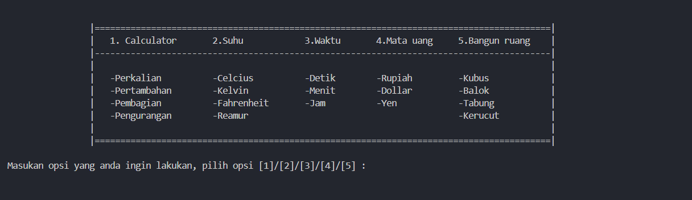

# 🌟 Project akhir samester 1

ini adalah projek akhir semester tema sains (matematika)
dengan menggunakan python kami kelompok 8 membuat proggram kalkulator sederhana

## Nama Kelompok

| Nama                     | nim      | kelas    |
| ------------------------ | -------- | -------- |
| Muhammad Rafi Ramdhani   | 15240411 | 15.1A.04 |
| Maeyumedi Davi           | 15240975 | 15.1A.04 |
| M.Akbar Ghozali          | 15240313 | 15.1A.04 |
| Jeremy Febrian Manuputty | 15240505 | 15.1A.04 |
| Arya Kurniawan           | 15240661 | 15.1A.04 |

## 📸 Screenshot



## 🚀 Fitur

- ⚡ Ramah pengguna baru karena dibuat dengan py native tanpa framework / library dan dengan sintaks yg readable

## 🛠 Instalasi

```bash
git clone https://github.com/username/proyek.git
cd proyek
py main.py
```

## 📝 Notes

- currency tidak akan bisa dipakai oleh orang luar karena itu menggunakan api


⬜⬜⬛⬛⬛⬛  
⬜⬜⬜⬛⬛⬛  
⬜🔳⬜⬜🔳⬜  
⬜⬜⬜⬜⬜⬜  
⬜⬜⬛⬛⬜⬜  
⬜⬜⬜⬜⬜⬜  
